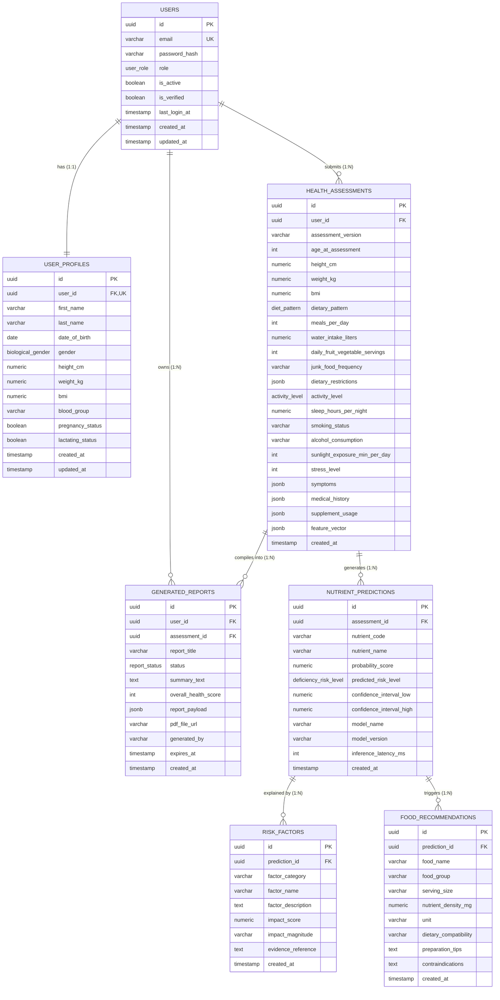

# PHASE 1: System Architecture & Database Engineering Blueprint

## Integrated AI-Based Nutrient Deficiency Screening and Personalized Nutrition Platform

---

### Executive Overview
This document outlines the Phase 1 architectural foundation for a clinical-grade, web-based nutritional screening platform. The platform captures multi-dimensional user health indicators, extracts normalized feature representations, executes AI/ML deficiency risk predictions, computes feature attributions (Explainability), and generates personalized food recommendations and structured clinical reports.

---

## 1. Database Architecture & Scalability Design

The database layer is engineered with **PostgreSQL 15+**, leveraging relational integrity for transactional accounts while utilizing **JSONB indexing (GIN)** for flexible medical conditions, symptom severity sets, and feature snapshots.

### Required Tables & Entity Definitions

1. **`users`**: Manages authentication identity, role-based access control (RBAC: `USER`, `NUTRITIONIST`, `CLINICIAN`, `ADMIN`), account status, and credentials.
2. **`user_profiles`**: One-to-one extension storing demographic baselines (date of birth, biological sex, baseline height/weight, computed BMI, pregnancy/lactation state).
3. **`health_assessments`**: Immutable point-in-time screening evaluation records containing user responses across dietary habits, lifestyle metrics, clinical symptoms, medical history, and current supplements.
4. **`nutrient_predictions`**: Inferred deficiency probabilities produced by AI/ML models (e.g. Vitamin D, B12, Iron, Zinc, Calcium, Folate) along with risk strata and confidence bounds.
5. **`risk_factors`**: Granular feature attributions explaining **why** an AI prediction was triggered (e.g., SHAP values, risk magnitude, dietary causes, clinical indicators).
6. **`food_recommendations`**: Dietary interventions filtered by nutrient bioavailability, dietary pattern compatibility (Vegan, Keto, etc.), serving metrics, and absorption synergies.
7. **`generated_reports`**: Aggregated assessment reports with health scores, executive summaries, static report payloads, and exportable PDF assets.

---

## 2. Entity Relationship (ER) Diagram



---

## 3. Relational Mapping & Foreign Key Integrity

| Primary Table | Foreign Table | Cardinality | Foreign Key Constraint | Delete Cascade Rule | Purpose |
| :--- | :--- | :--- | :--- | :--- | :--- |
| `users` | `user_profiles` | **1 : 1** | `user_profiles.user_id -> users.id` | `ON DELETE CASCADE` | Associates demographic profile to account; unique constraint ensures single profile. |
| `users` | `health_assessments`| **1 : N** | `health_assessments.user_id -> users.id` | `ON DELETE CASCADE` | Allows a user to take multiple periodic assessments over time. |
| `health_assessments` | `nutrient_predictions`| **1 : N** | `nutrient_predictions.assessment_id -> health_assessments.id` | `ON DELETE CASCADE` | One screening yields multiple nutrient predictions (e.g. Iron, B12, D3). |
| `nutrient_predictions` | `risk_factors` | **1 : N** | `risk_factors.prediction_id -> nutrient_predictions.id` | `ON DELETE CASCADE` | Each predicted deficiency contains multiple explainable driving features. |
| `nutrient_predictions` | `food_recommendations`| **1 : N** | `food_recommendations.prediction_id -> nutrient_predictions.id` | `ON DELETE CASCADE` | Connects targeted food interventions directly to the deficiency being addressed. |
| `users` / `health_assessments` | `generated_reports` | **1 : N** | `reports.user_id -> users.id`<br>`reports.assessment_id -> health_assessments.id` | `ON DELETE CASCADE` | Generates compiled report document referencing both user and screening event. |

---

## 4. Detailed Data Dictionary & Field Specifications

### User Input Fields Mapping (Requirements Matrix)

| User Input Requirement | Table Target | Field Name | Data Type & Constraint | Clinical & Validation Description |
| :--- | :--- | :--- | :--- | :--- |
| **1. Age** | `health_assessments` | `age_at_assessment` | `INT CHECK (1-125)` | Chronological age at time of evaluation. |
| **2. Gender** | `user_profiles` / `assessments` | `gender` | `biological_gender ENUM` | `'MALE'`, `'FEMALE'`, `'OTHER'`. Essential for iron/calcium RDA baselines. |
| **3. Height** | `health_assessments` | `height_cm` | `NUMERIC(5,2) CHECK (40-260)` | Patient stature in centimeters. |
| **4. Weight** | `health_assessments` | `weight_kg` | `NUMERIC(5,2) CHECK (20-350)` | Patient body mass in kilograms. |
| **5. BMI** | `health_assessments` | `bmi` | `NUMERIC(4,1)` | Computed as: `weight_kg / (height_m^2)`. Automated via DB generated column & API validator. |
| **6. Dietary Habits** | `health_assessments` | `dietary_pattern`, `meals_per_day`, `water_intake_liters`, `dietary_restrictions` | `diet_pattern ENUM`, `INT`, `NUMERIC(3,1)`, `JSONB` | Captures Vegan/Keto/etc., meal regularity, hydration, and allergies/restrictions. |
| **7. Lifestyle Factors**| `health_assessments` | `activity_level`, `sleep_hours_per_night`, `sunlight_exposure_min_per_day`, `stress_level` | `activity_level ENUM`, `NUMERIC(3,1)`, `INT`, `INT CHECK (1-10)` | Sedentary to athletic grading, sleep duration, UV sun exposure (Vit D synthesis), stress score. |
| **8. Symptoms** | `health_assessments` | `symptoms` | `JSONB (GIN indexed)` | Structured dictionary: `{"fatigue": 8, "brittle_nails": 6, "hair_loss": 5, "cramps": 3}` |
| **9. Medical History**| `health_assessments` | `medical_history` | `JSONB (GIN indexed)` | Array of prior conditions: `[{"condition": "Celiac", "impacts_absorption": true}]` |
| **10. Supplement Usage**| `health_assessments` | `supplement_usage` | `JSONB` | Current daily/weekly supplements: `[{"name": "Vitamin D3", "dose": "2000IU", "frequency": "DAILY"}]` |

---

## 5. Backend Architecture & System Modules

The backend is architected as a **Modular High-Performance Service** using FastAPI (Python 3.11+) to guarantee native compatibility with AI/ML tooling (NumPy, Scikit-learn, XGBoost, SHAP, PyTorch).

```
                      +------------------------------------------+
                      |         Web Client / Mobile App          |
                      +--------------------+---------------------+
                                           | HTTPS / REST / JWT
                                           v
+-----------------------------------------------------------------------------------------+
|                                    API Gateway Layer                                    |
|             Rate Limiting | CORS | JWT Bearer Auth | Request Schema Validation           |
+------------------------------------------+----------------------------------------------+
                                           |
    +------------------+-------------------+--------------------+--------------------+
    |                  |                   |                    |                    |
    v                  v                   v                    v                    v
+-----------+   +--------------+   +---------------+    +----------------+   +---------------+
| 1. Auth   |   | 2. Assessment|   | 3. Prediction |    | 4. Explainable |   | 5. Recommen-  |
|  Module   |   |    Module    |   |     Module    |    |     Module     |   |  dation Mod.  |
+-----+-----+   +-------+------+   +-------+-------+    +--------+-------+   +-------+-------+
      |                 |                  |                     |                   |
      |                 |                  +--------+------------+                   |
      |                 |                           |                                |
      |                 |                           v                                |
      |                 |              +-------------------------+                   |
      |                 |              | ML Feature Pipeline &   |                   |
      |                 |              | Inference Engine (SHAP) |                   |
      |                 |              +------------+------------+                   |
      |                 |                           |                                |
      |                 +---------------------------+--------------------------------+
      |                                             |
      |                                             v
      |                                   +-------------------+
      |                                   |   6. Reporting    |
      |                                   |      Module       |
      |                                   +---------+---------+
      |                                             |
      +----------------------+----------------------+
                             v
           +-----------------------------------+
           |    Data Access Layer (SQLAlchemy) |
           +-----------------+-----------------+
                             v
           +-----------------------------------+
           |   PostgreSQL 15+ (Relational+GIN) |
           +-----------------------------------+
```

### Module Responsibilities

1. **Authentication Module (`app/modules/auth`)**:
   - Manages user registration, Argon2/Bcrypt password hashing, email verification, and OAuth2 JWT token lifecycle.
   - Enforces RBAC permissions for regular users vs nutritionist/clinician auditors.

2. **Assessment Module (`app/modules/assessment`)**:
   - Ingests and sanitizes the 10 user screening fields.
   - Executes domain validation (BMI limits, physiological bounds, logical cross-validation).
   - Generates point-in-time assessment records.

3. **Prediction Module (`app/modules/prediction`)**:
   - Converts raw assessment parameters into standardized feature matrices (`feature_pipeline.py`).
   - Runs ensemble inference models (e.g., Multi-output gradient boosting / Random Forest) returning deficiency probabilities for 15+ micronutrients.
   - Logs model versions, confidence intervals, and inference latencies.

4. **Explainability Module (`app/modules/explainability`)**:
   - Computes local feature attribution (SHAP TreeExplainer / KernelExplainer).
   - Translates raw mathematical attribution weights into human-understandable clinical statements (e.g., *"Strict veganism without B12 fortified foods contributed 48% to predicted Cobalamin deficiency"*).

5. **Recommendation Module (`app/modules/recommendation`)**:
   - Rules-and-ranking engine that matches flagged deficiencies to verified food databases.
   - Evaluates dietary compatibility filters (e.g. omitting shellfish for vegans, adjusting dairy for lactose intolerant).
   - Generates actionable culinary preparation tips to optimize absorption (e.g. non-heme iron + Vitamin C).

6. **Reporting Module (`app/modules/reporting`)**:
   - Compiles assessment results, predictions, SHAP risk drivers, and dietary interventions into a consolidated snapshot.
   - Computes an aggregate nutritional resilience score (0-100).
   - Renders downloadable clinical PDF documents using ReportLab / headless HTML rendering.

---

## 6. REST API Specification

### Authentication Endpoints
- `POST /api/v1/auth/register` - Create account (User, Email, Password).
- `POST /api/v1/auth/login` - Authenticate & obtain JWT Access and Refresh tokens.
- `GET  /api/v1/auth/me` - Retrieve authenticated user profile.

### User Profile Endpoints
- `GET  /api/v1/profiles/me` - Fetch demographic and physical baseline profile.
- `PUT  /api/v1/profiles/me` - Update profile data (height, weight, pregnancy status).

### Assessment Endpoints
- `POST /api/v1/assessments` - Submit a new 10-field nutritional screening.
  - **Request Body**:
    ```json
    {
      "age": 31,
      "gender": "MALE",
      "height_cm": 178.0,
      "weight_kg": 74.5,
      "dietary_habits": {
        "dietary_pattern": "VEGAN",
        "meals_per_day": 3,
        "water_intake_liters": 2.5,
        "daily_fruit_vegetable_servings": 4,
        "junk_food_frequency": "RARELY",
        "dietary_restrictions": ["dairy-free", "egg-free", "meat-free"]
      },
      "lifestyle_factors": {
        "activity_level": "MODERATELY_ACTIVE",
        "sleep_hours_per_night": 6.5,
        "smoking_status": "NEVER",
        "alcohol_consumption": "OCCASIONAL",
        "sunlight_exposure_min_per_day": 10,
        "stress_level": 7
      },
      "symptoms": {
        "chronic_fatigue": 8,
        "brittle_nails": 6,
        "cold_hands_feet": 7,
        "brain_fog": 5
      },
      "medical_history": [
        {
          "condition_name": "Mild Acid Reflux",
          "diagnosed_year": 2022,
          "is_active": true,
          "impacts_absorption": false
        }
      ],
      "supplement_usage": []
    }
    ```
- `GET  /api/v1/assessments/{assessment_id}` - Retrieve detailed assessment records.
- `GET  /api/v1/assessments` - List historical assessments for logged-in user.

### Prediction & Explainability Endpoints
- `POST /api/v1/assessments/{assessment_id}/predict` - Trigger ML deficiency inference pipeline.
- `GET  /api/v1/assessments/{assessment_id}/predictions` - Fetch predicted deficiency scores and risk tiers.
- `GET  /api/v1/predictions/{prediction_id}/explainability` - Fetch SHAP feature attribution and clinical causal drivers.

### Food Recommendations Endpoints
- `GET  /api/v1/assessments/{assessment_id}/recommendations` - Fetch personalized food recommendations matching detected deficiencies.

### Reporting Endpoints
- `POST /api/v1/assessments/{assessment_id}/reports` - Generate comprehensive report snapshot.
- `GET  /api/v1/reports/{report_id}` - Retrieve compiled report data.
- `GET  /api/v1/reports/{report_id}/pdf` - Download clinical PDF summary.

---

## 7. Folder Structure

```
Nutrient deficiency/
├── backend/
│   ├── app/
│   │   ├── __init__.py
│   │   ├── main.py                    # Application factory & middleware configuration
│   │   ├── core/                      # Global singletons & security
│   │   │   ├── __init__.py
│   │   │   ├── config.py              # Environment settings (Pydantic Settings)
│   │   │   ├── security.py            # Password hashing & JWT token verification
│   │   │   └── database.py            # Async SQLAlchemy engine & sessionmaker
│   │   ├── models/                    # Declarative ORM Database entities
│   │   │   ├── __init__.py
│   │   │   ├── user.py                # User & UserProfile models
│   │   │   ├── assessment.py          # HealthAssessment model
│   │   │   ├── prediction.py          # NutrientPrediction & RiskFactor models
│   │   │   ├── recommendation.py      # FoodRecommendation model
│   │   │   └── report.py              # GeneratedReport model
│   │   ├── schemas/                   # Pydantic validation models / DTOs
│   │   │   ├── __init__.py
│   │   │   ├── user.py
│   │   │   ├── assessment.py          # 10 clinical input fields validation
│   │   │   ├── prediction.py
│   │   │   ├── explainability.py
│   │   │   ├── recommendation.py
│   │   │   └── report.py
│   │   ├── modules/                   # Core Domain & Application services
│   │   │   ├── auth/                  # 1. Authentication Module
│   │   │   │   ├── __init__.py
│   │   │   │   ├── router.py
│   │   │   │   └── service.py
│   │   │   ├── assessment/            # 2. Assessment Module
│   │   │   │   ├── __init__.py
│   │   │   │   ├── router.py
│   │   │   │   └── service.py
│   │   │   ├── prediction/            # 3. Prediction Module (AI/ML)
│   │   │   │   ├── __init__.py
│   │   │   │   ├── feature_pipeline.py# Raw input to ML feature vector transformation
│   │   │   │   ├── model_runner.py    # Model artifact loader & inference
│   │   │   │   └── router.py
│   │   │   ├── explainability/        # 4. Explainability Module (SHAP)
│   │   │   │   ├── __init__.py
│   │   │   │   ├── explainer.py       # SHAP / LIME computation
│   │   │   │   └── service.py
│   │   │   ├── recommendation/        # 5. Recommendation Module
│   │   │   │   ├── __init__.py
│   │   │   │   ├── engine.py          # Nutrient-to-food mapping & filtering
│   │   │   │   └── router.py
│   │   │   └── reporting/             # 6. Reporting Module
│   │   │       ├── __init__.py
│   │   │       ├── generator.py       # JSON payload & score compilation
│   │   │       ├── pdf_service.py     # PDF document builder
│   │   │       └── router.py
│   │   └── api/
│   │       ├── __init__.py
│   │       └── v1/
│   │           ├── __init__.py
│   │           └── api_router.py      # Centralized V1 route aggregator
├── database/
│   ├── schema.sql                     # Production DDL schema
│   ├── seeds.sql                      # Reference seed data & clinical lookups
│   └── migrations/                    # Alembic schema versioning
├── docs/
│   ├── architecture_phase1.md         # Master architecture blueprint
│   ├── api_specification.md           # Detailed OpenAPI / JSON schema docs
│   └── database_dictionary.md         # Column-by-column reference
├── ml_artifacts/                      # Trained model binaries (PKL / ONNX)
│   └── .gitkeep
├── tests/
│   ├── conftest.py
│   ├── test_auth.py
│   ├── test_assessment.py
│   └── test_prediction_pipeline.py
├── docker-compose.yml                 # Multi-container orchestration (DB + API)
├── Dockerfile                         # Backend container specification
├── requirements.txt                   # Python dependencies (Web + ML)
└── README.md                          # Project onboarding & setup instructions
```

---

## 8. Machine Learning (ML) Integration Readiness Strategy

To guarantee seamless transition into Phase 2 (ML Model Training & Deployment), the Phase 1 architecture implements specific AI-ready design patterns:

1. **Deterministic Feature Pipeline (`feature_pipeline.py`)**:
   - Transforms heterogeneous questionnaire inputs (e.g. categorical diet, continuous BMI, sparse symptoms map) into fixed-dimension numeric vectors with imputed missing values.
2. **Immutable Versioned Inputs (`assessment_version` & `feature_vector`)**:
   - Stored in `health_assessments` as serialized JSONB to prevent training-serving skew and support retrospective backtesting.
3. **Multi-Model Support**:
   - `nutrient_predictions` records `model_name` and `model_version`, allowing seamless A/B testing or ensembling across different algorithms (e.g. XGBoost vs LightGBM vs Deep Tabular).
4. **SHAP TreeExplainer Hook**:
   - Designed to run alongside inference; extracts top positive and negative marginal contribution features directly into the `risk_factors` table.
