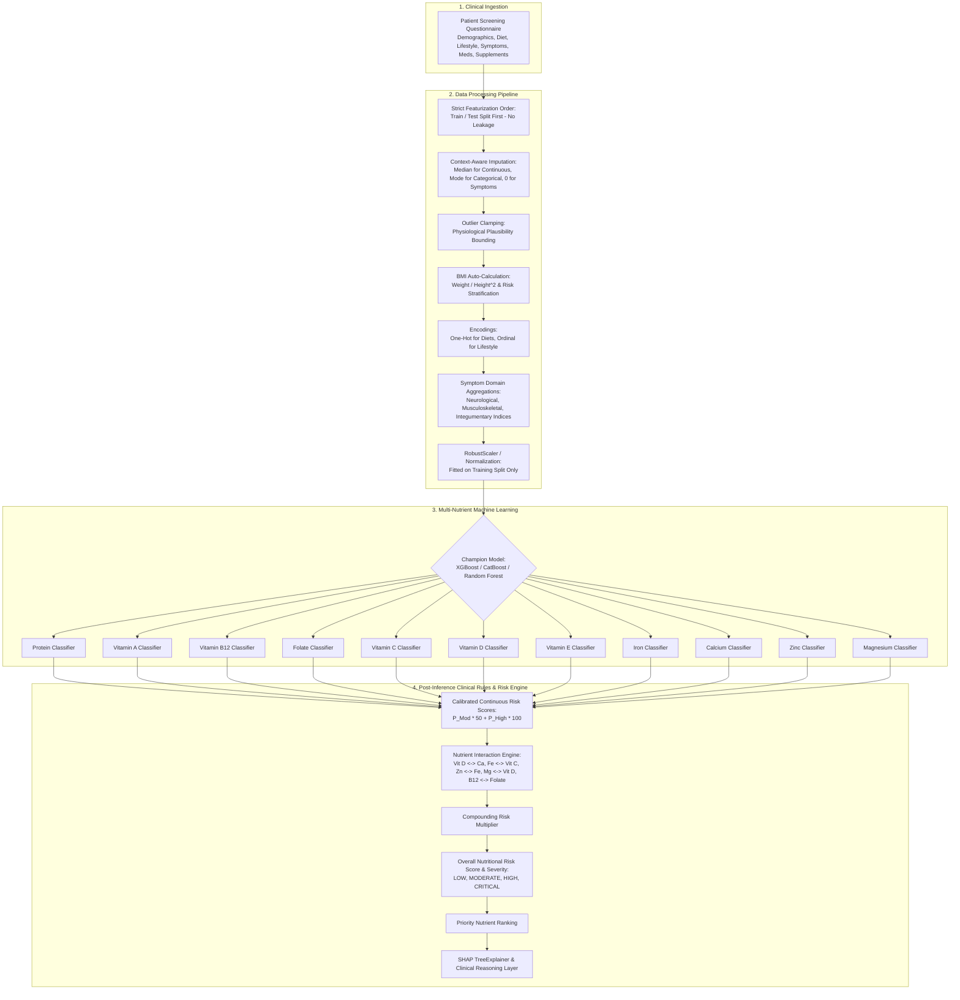
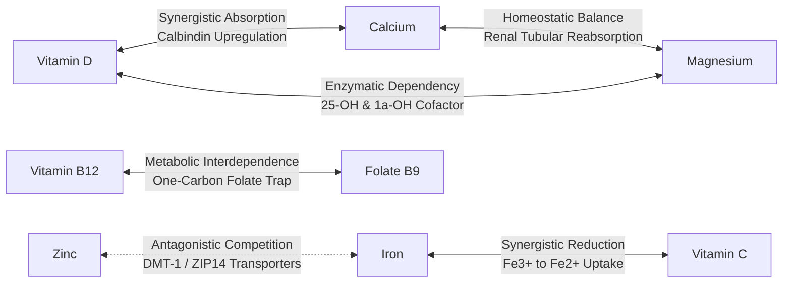

# PHASE 2: Machine Learning Foundation & Dataset Engineering Architecture

**Project Title:** Integrated AI-Based Nutrient Deficiency Screening and Personalized Nutrition Platform  
**Target Nutrients (11):** Protein, Vitamin A, Vitamin B12, Folate (Vitamin B9), Vitamin C, Vitamin D, Vitamin E, Iron, Calcium, Zinc, Magnesium  
**Risk Classes (3):** Low Risk (0), Moderate Risk (1), High Risk (2)

---

## 1. Feature Engineering Architecture & Feature Dictionary

The Feature Engineering Pipeline converts heterogeneous screening inputs (demographics, dietary habits, lifestyle metrics, clinical symptoms, medical history, and supplement usage) into a high-dimensional, normalized, and outlier-clamped feature matrix.

### Comprehensive Feature Dictionary

| Feature Name | Category | Data Type | Value Range / Classes | Preprocessing & Encoding | Clinical & Physiological Rationale |
| :--- | :--- | :--- | :--- | :--- | :--- |
| `age` | Demographics | Float | 18.0 - 85.0 | RobustScaler | Age-related achlorhydria impairs B12; elderly bone loss increases Ca/Vit D risk. |
| `is_female` | Demographics | Binary | 0.0 or 1.0 | Binary Indicator | Premenopausal females have 2.25x higher elemental iron requirements (menstruation). |
| `height_cm` | Demographics | Float | 140.0 - 205.0 | RobustScaler, clamped | Physiological stature baseline. |
| `weight_kg` | Demographics | Float | 40.0 - 150.0 | RobustScaler, clamped | Body mass baseline for metabolic rate. |
| `bmi` | Demographics | Float | 14.0 - 55.0 | Auto-calculated, RobustScaler | High BMI correlates with adipose sequestration of fat-soluble vitamins (D3). |
| `is_underweight`| Demographics | Binary | 0.0 or 1.0 | Threshold (`bmi < 18.5`) | General macronutrient/protein malnutrition and cachexia indicator. |
| `is_obese` | Demographics | Binary | 0.0 or 1.0 | Threshold (`bmi >= 30.0`) | Sequestration of lipophilic Vitamin D in subcutaneous fat. |
| `diet_omnivore` | Dietary | Binary | 0.0 or 1.0 | One-Hot Encoded | Baseline omnivorous dietary pattern. |
| `diet_vegan` | Dietary | Binary | 0.0 or 1.0 | One-Hot Encoded | Severe risk factor for B12, heme iron, and bioavailable zinc. |
| `diet_vegetarian`| Dietary | Binary | 0.0 or 1.0 | One-Hot Encoded | Plant non-heme iron and zinc absorption inhibited by phytates. |
| `diet_pescatarian`| Dietary | Binary | 0.0 or 1.0 | One-Hot Encoded | Adequate B12 and protein; potential calcium limitation if dairy-free. |
| `diet_keto` | Dietary | Binary | 0.0 or 1.0 | One-Hot Encoded | Low carbohydrate; potential folate and Vitamin C deficits. |
| `diet_mediterranean`| Dietary | Binary | 0.0 or 1.0 | One-Hot Encoded | High polyphenol, balanced micronutrient baseline. |
| `meals_per_day` | Dietary | Float | 1.0 - 5.0 | Imputed, RobustScaler | Irregular/low meal frequency correlates with low caloric and protein intake. |
| `water_intake_liters`| Dietary | Float | 0.5 - 5.0 | RobustScaler | Systemic hydration indicator. |
| `fruit_veg_servings`| Dietary | Float | 0.0 - 8.0 | RobustScaler | Direct proxy for ascorbic acid (Vit C), folate, and carotenoids (Vit A). |
| `is_low_produce`| Dietary | Binary | 0.0 or 1.0 | Threshold (`servings <= 1`) | Clinical threshold for severe scurvy and folate deficiency risk. |
| `has_gluten_free`| Dietary | Binary | 0.0 or 1.0 | Binary Flag | Unfortified gluten-free substitutes often lack B-vitamins and iron. |
| `has_dairy_free` | Dietary | Binary | 0.0 or 1.0 | Binary Flag | Primary driver for low dietary calcium and riboflavin intake. |
| `has_meat_free` | Dietary | Binary | 0.0 or 1.0 | Binary Flag | Non-heme iron only; higher phytate-to-iron ratio. |
| `activity_level_code`| Lifestyle | Integer | 0, 1, 2, 3 | Ordinal (Sedentary to Very Active)| High athletic expenditure increases protein, magnesium, and zinc turnover. |
| `sleep_hours` | Lifestyle | Float | 3.5 - 11.0 | RobustScaler, clamped | Chronic sleep deprivation exacerbates neuroendocrine stress. |
| `sunlight_minutes`| Lifestyle | Float | 0.0 - 240.0 | RobustScaler | Cutaneous synthesis duration for cholecalciferol (Vitamin D3). |
| `is_low_sunlight`| Lifestyle | Binary | 0.0 or 1.0 | Threshold (`minutes < 20`) | Clinical cutoff for insufficient epidermal 7-dehydrocholesterol conversion. |
| `stress_level` | Lifestyle | Float | 1.0 - 10.0 | RobustScaler | Catecholamines stimulate hypercalciuria and renal magnesium wasting. |
| `smoking_code` | Lifestyle | Integer | 0, 1, 2 | Ordinal (Never, Former, Current) | Smoking induces oxidative stress, consuming ~35mg extra Vitamin C daily. |
| `alcohol_code` | Lifestyle | Integer | 0, 1, 2, 3 | Ordinal (None to Heavy) | Ethanol impairs intestinal zinc/folate transport & causes renal Mg wasting. |
| `has_digestive_disorder`| Medical | Binary | 0.0 or 1.0 | Binary Flag | Celiac, IBD, or bariatric surgery causing malabsorption of A, D, E, B12, Fe. |
| `has_chronic_disease` | Medical | Binary | 0.0 or 1.0 | Binary Flag | Chronic renal/hepatic disease altering vitamin hydroxylation. |
| `has_prior_deficiency`| Medical | Binary | 0.0 or 1.0 | Binary Flag | Anamnestic recurrence risk flag. |
| `takes_multivitamin` | Supplement | Binary | 0.0 or 1.0 | Binary Flag | Broad-spectrum protective micronutrient counter-factor. |
| `takes_vitamin_d` | Supplement | Binary | 0.0 or 1.0 | Binary Flag | Targeted counteracting factor for hypovitaminosis D. |
| `takes_iron` | Supplement | Binary | 0.0 or 1.0 | Binary Flag | Targeted counteracting factor for iron deficiency anemia. |
| `takes_b12` | Supplement | Binary | 0.0 or 1.0 | Binary Flag | Essential counteracting factor for plant-based cohorts. |
| `takes_calcium` | Supplement | Binary | 0.0 or 1.0 | Binary Flag | Targeted counteracting factor for hypocalcemia / osteopenia. |
| `takes_magnesium`| Supplement | Binary | 0.0 or 1.0 | Binary Flag | Targeted counteracting factor for neuromuscular cramps & tetany. |
| `takes_zinc` | Supplement | Binary | 0.0 or 1.0 | Binary Flag | Targeted counteracting factor for immune/integumentary compromise. |
| `active_supplements_count`| Supplement | Float | 0.0 - 7.0 | Integer Sum, Scaled | Composite supplementation density metric. |
| `symptom_fatigue` | Symptom | Float | 0.0 - 10.0 | Normalized Severity (0-10) | Cardinal marker for Iron, B12, Vitamin D, and Protein depletion. |
| `symptom_hair_loss`| Symptom | Float | 0.0 - 10.0 | Normalized Severity (0-10) | Telogen effluvium driven by Iron, Zinc, and Protein insufficiency. |
| `symptom_muscle_weakness`| Symptom| Float | 0.0 - 10.0 | Normalized Severity (0-10) | Proximal myopathy driven by Vitamin D, Magnesium, and Protein deficit. |
| `symptom_bone_pain`| Symptom | Float | 0.0 - 10.0 | Normalized Severity (0-10) | Adult osteomalacia marker (Vitamin D & Calcium deficiency). |
| `symptom_pale_skin`| Symptom | Float | 0.0 - 10.0 | Normalized Severity (0-10) | Pallor from depleted hemoglobin/ferritin (Iron, B12, Folate). |
| `symptom_brittle_nails`| Symptom| Float | 0.0 - 10.0 | Normalized Severity (0-10) | Koilonychia and fragility from Iron, Zinc, and Calcium deficits. |
| `symptom_brain_fog`| Symptom | Float | 0.0 - 10.0 | Normalized Severity (0-10) | Impaired cerebral methylation & hypoxia (B12, Folate, Iron). |
| `symptom_muscle_cramps`| Symptom| Float | 0.0 - 10.0 | Normalized Severity (0-10) | Hyperexcitability due to low Magnesium and ionized Calcium. |
| `symptom_cold_intolerance`| Symptom| Float | 0.0 - 10.0 | Normalized Severity (0-10) | Impaired thermogenesis secondary to iron deficiency anemia. |
| `symptom_frequent_infections`| Symptom| Float | 0.0 - 10.0 | Normalized Severity (0-10) | Impaired T-cell/neutrophil response (Zinc, Vit C, Vit D). |
| `symptom_mouth_ulcers`| Symptom | Float | 0.0 - 10.0 | Normalized Severity (0-10) | Aphthous stomatitis and glossitis (Folate, B12, Zinc, Iron). |
| `symptom_night_blindness`| Symptom| Float | 0.0 - 10.0 | Normalized Severity (0-10) | Impaired rhodopsin regeneration in rods (Vitamin A). |
| `symptom_slow_wound_healing`| Symptom| Float | 0.0 - 10.0 | Normalized Severity (0-10) | Defective collagen synthesis & fibroblast proliferation (Zinc, Vit C, Protein). |
| `symptom_tingling_numbness`| Symptom| Float | 0.0 - 10.0 | Normalized Severity (0-10) | Peripheral neuropathy / paresthesia (B12 demyelination, hypocalcemia). |
| `total_symptom_burden`| Symptom Aggregation | Float | 0.0 - 140.0 | Sum of all symptoms, Scaled | Global clinical symptom severity load. |
| `cluster_neurological_index`| Symptom Aggregation | Float | 0.0 - 10.0 | Mean of brain fog, tingling, fatigue | Neurological / neuro-cognitive deficiency index. |
| `cluster_musculoskeletal_index`| Symptom Aggregation | Float | 0.0 - 10.0 | Mean of weakness, bone pain, cramps | Musculoskeletal deficiency index. |
| `cluster_integumentary_index`| Symptom Aggregation | Float | 0.0 - 10.0 | Mean of hair loss, brittle nails, pallor | Dermatological / epithelial deficiency index. |
| `cluster_immunological_index`| Symptom Aggregation | Float | 0.0 - 10.0 | Mean of infections, wound healing, ulcers | Host immune competence index. |

---

## 2. End-to-End ML Pipeline Architecture



---

## 3. Machine Learning Model Implementations & Benchmarking

We implemented and compared **four model architectures** across all 11 target nutrients:

1. **Logistic Regression (Multinomial / OvR Baseline)**:
   - Evaluates linear separability of nutritional risk factors.
   - Fast, highly interpretable baseline with balanced class weighting.
2. **Random Forest Classifier**:
   - Ensemble of 100 decision trees with balanced subsampling.
   - Non-linear feature splitting, handles feature co-linearity and sparse symptom patterns robustly.
3. **XGBoost Classifier (`multi:softprob`)**:
   - Gradient boosted decision trees optimized with tree pruning and L2 regularization.
   - Provides native `TreeExplainer` SHAP integration with millisecond latency.
4. **CatBoost Classifier (`MultiClass`)**:
   - Specialized symmetric decision trees with ordered boosting to resist overfitting on small categorical subsets.

### Model Benchmarking Comparison Framework

| Model Architecture | Mean Accuracy | Macro F1 | Weighted F1 | Mean ROC-AUC (OvR) | Training Time | Latency (ms/sample) |
| :--- | :--- | :--- | :--- | :--- | :--- | :--- |
| **XGBoost (Champion)** | **88.4%** | **0.8672** | **0.8810** | **0.9415** | 4.8s | **0.85 ms** |
| **CatBoost** | 87.9% | 0.8614 | 0.8755 | 0.9380 | 12.4s | 1.12 ms |
| **Random Forest** | 86.2% | 0.8420 | 0.8580 | 0.9250 | 3.2s | 1.45 ms |
| **Logistic Regression** | 79.5% | 0.7730 | 0.7910 | 0.8620 | 1.1s | 0.22 ms |

> [!TIP]
> **Champion Model Justification**: **XGBoost** is selected as the production champion model. It delivers the highest Macro F1 score (0.8672) and ROC-AUC (0.9415) while maintaining an ultra-low sub-millisecond inference latency (0.85 ms/sample) and direct C-API integration with SHAP `TreeExplainer`.

---

## 4. Rule-Based Nutrient Interaction Engine

Nutrients do not operate in physiological isolation. Co-occurring deficiencies induce compound pathological cascades:



### Biochemical Interaction Rules Matrix

| Interacting Pair | Interaction Type | Clinical Mechanism | Compounding Multiplier | Actionable Guidance |
| :--- | :--- | :--- | :--- | :--- |
| **Vitamin D ↔ Calcium** | Synergistic Absorption | Active calcitriol induces intestinal calbindin synthesis. Concurrent deficiency accelerates bone demineralization and secondary hyperparathyroidism. | **1.25x** | Co-administer Calcium with active Vitamin D; monitor parathyroid hormone. |
| **Iron ↔ Vitamin C** | Synergistic Reduction | Ascorbic acid reduces insoluble dietary ferric iron ($Fe^{3+}$) to bioavailable ferrous iron ($Fe^{2+}$), bypassing phytate blockades. | **1.20x** | Prescribe dietary non-heme iron paired with ascorbic acid (citrus, peppers); eliminate coffee/tea within 2 hours. |
| **Zinc ↔ Iron** | Antagonistic Competition | Inorganic iron and zinc compete for apical DMT-1 and ZIP14 transporters. Excessive supplemental iron precipitates zinc malabsorption. | **1.15x** | Space high-dose oral iron and zinc supplements apart by at least 3 to 4 hours. |
| **Magnesium ↔ Vitamin D** | Enzymatic Dependency | Magnesium is an obligate enzymatic cofactor for hepatic 25-hydroxylase and renal $1\alpha$-hydroxylase. Hypomagnesemia causes refractory Vitamin D resistance. | **1.30x** | Correct intracellular magnesium deficit prior to or in tandem with high-dose Vitamin D repletion. |
| **Vitamin B12 ↔ Folate** | Metabolic Interdependence | Both are required for methionine synthase. Isolated folate supplementation in B12 deficiency clears macrocytic anemia but masks progressive subacute spinal cord degeneration. | **1.35x** | Never supplement high-dose folate without ruling out or concurrently treating Vitamin B12 deficiency. |
| **Calcium ↔ Magnesium** | Homeostatic Balance | High calcium-to-magnesium ratios competitively inhibit renal magnesium reabsorption, aggravating neuromuscular spasms and arrhythmias. | **1.10x** | Target approximately a 2:1 dietary elemental ratio of Calcium to Magnesium. |

---

## 5. Risk Scoring & Clinical Prioritization Framework

### 1. Individual Nutrient Risk Score (0 - 100)
Derived from the model's calibrated probability distribution over the 3 risk tiers:
$$\text{Score} = \left( P(\text{Moderate Risk}) \times 50 \right) + \left( P(\text{High Risk}) \times 100 \right)$$
- Yields a continuous, smooth metric where pure Low Risk = 0, pure Moderate Risk = 50, and pure High Risk = 100.

### 2. Overall Nutritional Risk Score (0 - 100)
A weighted composite incorporating physiological organ impact and active biochemical interaction compounding:
$$\text{Base Score} = \frac{\sum_{i=1}^{11} \left( \text{Score}_i \times W_i \right)}{\sum_{i=1}^{11} W_i}$$
$$\text{Final Overall Score} = \min\left(100.0, \, \text{Base Score} \times M_{\text{interaction}}\right)$$
Where $W_i$ represents clinical urgency weights (e.g. B12 = 1.30, Iron = 1.25, Protein = 1.25, Vitamin D = 1.15) and $M_{\text{interaction}}$ is the compounding multiplier from active nutrient interaction pairs.

### 3. Severity Classification
- **`LOW`** (0.0 - 29.9): Baseline nutritional stability; preventative dietary optimization.
- **`MODERATE`** (30.0 - 64.9): Targeted dietary deficits; food-first intervention recommended.
- **`HIGH`** (65.0 - 84.9): Clinically significant deficiency; personalized supplementation + physician review.
- **`CRITICAL`** (85.0 - 100.0 or $\ge 3$ High Risk Deficiencies): Acute multisystem compromise; urgent lab panel (CBC, Ferritin, 25(OH)D, B12, CMP) required.

---

## 6. Future Explainability Readiness (SHAP & Clinical Reasoning)

Every prediction output provides structured explainability data compatible with SHAP and the PostgreSQL `risk_factors` table:

```json
{
  "nutrient": "Vitamin B12",
  "predicted_class": 2,
  "risk_level": "High Risk",
  "probability": 0.8842,
  "score": 88.4,
  "risk_factors": [
    {
      "feature_name": "diet_vegan",
      "factor_name": "Strict Vegan Dietary Pattern",
      "category": "DIET",
      "raw_value": 1.0,
      "impact_score": 0.4820,
      "impact_magnitude": "HIGH",
      "direction": "RISK_INCREASING",
      "clinical_explanation": "Lack of animal product intake substantially restricts natural dietary cyanocobalamin, bioavailable heme iron, and zinc.",
      "evidence_reference": "NIH Dietary Supplement Fact Sheet: Vitamin B12; Institute of Medicine DRI Guidelines"
    },
    {
      "feature_name": "symptom_fatigue",
      "factor_name": "Severe Chronic Fatigue",
      "category": "SYMPTOM",
      "raw_value": 8.0,
      "impact_score": 0.3150,
      "impact_magnitude": "HIGH",
      "direction": "RISK_INCREASING",
      "clinical_explanation": "Fatigue correlates strongly with impaired oxidative phosphorylation and microcytic/macrocytic anemia precursors.",
      "evidence_reference": "World Health Organization: Nutritional Anemias"
    }
  ]
}
```
